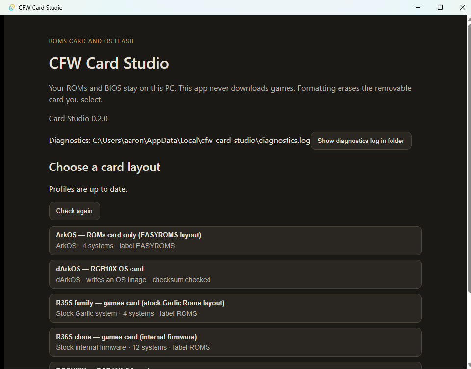
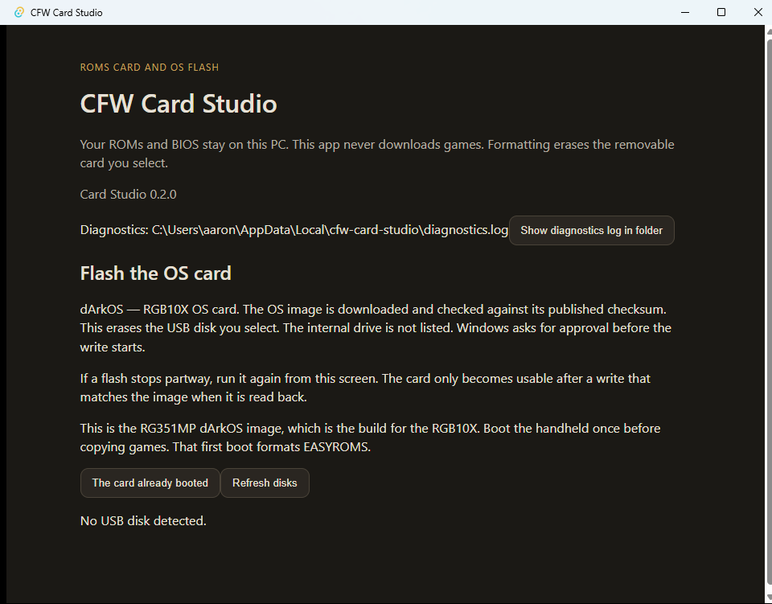

<div align="center">
  
  <h1>CFW Card Studio</h1>
  <p><strong>Zero-touch setup for handheld CFW cards: flash the firmware, then fill the card with the ROMs you already own — without the flash&nbsp;→&nbsp;boot&nbsp;→&nbsp;pull&nbsp;the&nbsp;card&nbsp;→&nbsp;copy&nbsp;→&nbsp;reinsert dance.</strong></p>

  [](https://github.com/toilmonkey0-cyber/cfw-zero-touch/actions/workflows/ci.yml)
  [](https://github.com/toilmonkey0-cyber/cfw-zero-touch/releases)
  [](LICENSE)
  
  
  

  
</div>

---

A Windows desktop app for setting up SD cards for custom firmware on retro handhelds. It covers the whole job in one wizard: pick a layout, optionally flash the OS image with checksum and read-back verification, then copy your own ROM library into the right folders on the card.

It is built for the moment the usual tutorials get wrong. On single-card ArkOS/dArkOS setups, copying games right after flashing looks like it worked — and then the handheld's first boot reformats `EASYROMS` and wipes them. Card Studio treats that as a hard design constraint: it understands the first-boot scripts, refuses to copy games onto a card that is still armed, and only reports a card ready when it actually is.

## Contents

- [Features](#features)
- [Supported card layouts](#supported-card-layouts)
- [Why flashing here is different](#why-flashing-here-is-different)
- [Privacy and legal](#privacy-and-legal)
- [Requirements](#requirements)
- [Build from source](#build-from-source)
- [Documentation](#documentation)
- [Project status](#project-status)
- [Contributing](#contributing)
- [License](#license)

## Features

**Card preparation**
- Lists removable volumes only. The internal drive and fixed disks are never offered, and a removable disk reporting size 0 (empty reader) is skipped.
- Volume gate checks drive type, filesystem, and size before anything is written; a formatting action requires you to type `FORMAT` and name the expected card size first.
- Creates the folder layout each CFW expects (`Roms/GBA` on a stock Garlic card, root `gba` on an ArkOS card, nested `roms/gba` on ROCKNIX, and so on) from a declarative profile.
- Copies from a library folder you point it at, skipping unchanged files, never deleting stock folders that already exist on the card, and writing through a `.cfwpart` temp name so an interrupted copy cannot leave truncated ROMs.
- Refuses to copy onto a card whose first-boot scripts are still armed (see below).

**OS flashing**
- Downloads the device image, verifies it against the published SHA-256, writes it to a confirmed USB disk, then reads the card back and compares. A flash is only reported as successful on a matching read-back.
- Requires typing `FLASH`, refuses disk 0 and the system disk, matches the displayed card size against `Get-Disk`, and elevates for the write so Windows shows a UAC prompt.
- Handles raw `.img`, `.img.gz`, and split `.7z` archives, caching a verified unpacked image so a retry doesn't re-download.
- Built-in first-boot flow for one-slot dArkOS cards: flash, boot the handheld once so it expands `EASYROMS`, then copy the library into the expanded volume.

**Library tools (optional)**
- **igir DAT sorting** — hand it a DAT folder (for example No-Intro from datomatic) and it filters by region, keeps 1G1R, and sorts into per-system folders. Runs entirely on your machine; DATs are supplied by you.
- **Local-AI smart sort (Needle)** — for messy, DAT-less libraries: classifies titles by name, detects duplicate region variants before they burn card space, and explains card state or a refusal in plain language. Inference runs on-device, the engine and weights are downloaded only with your consent and verified against SHA-256 pins, and every result is advisory — model output never becomes a path or a disk decision.

**Extras**
- Six card layouts driven by JSON profiles with a published schema, so a new device is a data change.
- Profile update feed and an in-app update check.
- Local diagnostics log (`%LOCALAPPDATA%\cfw-card-studio\diagnostics.log`) recording what the app did, viewable from the footer. It never leaves your PC and never records ROM file names.

## Supported card layouts

| Layout | Card type | Volume label | Systems |
| --- | --- | --- | --- |
| ArkOS — ROMs card only | Games card (no OS) | `EASYROMS` | 4 |
| dArkOS — RGB10X OS card | OS image + games card | `EASYROMS` (formatted on first boot) | — |
| R35S family — games card | Stock Garlic layout | `ROMS` | 4 |
| R36S clone — games card | Internal-firmware layout | `ROMS` | 12 |
| ROCKNIX — RGB10X OS card | OS image + games card | `ROCKNIX` | — |
| ROCKNIX — ROMs card only | Games card (no OS) | `SHARE` | 5 |

Verified on hardware during development: Powkiddy RGB10X (ROCKNIX and dArkOS RG351MP flashes reaching the game menu, both with matching read-back checksums), an R36S clone loaded with a 12-system library, and an R35S-family stock card.

## Why flashing here is different

Anything that writes raw images to disks deserves paranoia. The gates below are not incidental tests — they are the product:

| Guard | What it prevents |
| --- | --- |
| Removable-media-only volume list | Writing to your SSD or a fixed recovery partition |
| Size + label confirmation before `FORMAT` | Wiping the wrong card, or one you didn't mean to erase |
| Published-SHA-256 check before writing | Flashing a truncated or tampered image |
| Read-back comparison after writing | Reporting success on a card that will not boot |
| `FLASH` typed confirmation + UAC elevation | Accidental writes; the app never self-elevates silently |
| Armed-firstboot gate | Copying games onto a card whose first boot will reformat them |
| `.cfwpart` temp-then-rename copies | Half-written ROMs after an interrupted copy |

<div align="center">
  
  <p><em>With no card inserted, the flash step reports no target. The internal drive is never listed.</em></p>
</div>

The design and its accepted limits are written up in [`SECURITY.md`](SECURITY.md) and [`docs/PRODUCT.md`](docs/PRODUCT.md).

## Privacy and legal

- **This app never ships or downloads ROMs or BIOS files.** You point it at files you already own; nothing game-related is fetched, bundled, or uploaded.
- DAT files for the optional igir sort are yours to supply (No-Intro's datomatic, for example).
- The local-AI tier downloads software only — an Apache-2.0 engine and its weights — and only after you accept, verified against SHA-256 pins compiled into the app. See [`THIRD_PARTY_NOTICES.md`](THIRD_PARTY_NOTICES.md).
- The profile feed is fetched from `raw.githubusercontent.com` on launch; that is the only automatic network request. Flashing downloads images only when you ask it to. `CFW_FEED_URL` overrides the feed for development.
- Everything else stays local: no telemetry, no accounts, no analytics, and filenames never leave your machine.

## Requirements

- Windows 10 or 11 (the flash pipeline uses Windows disk APIs; other platforms are not supported yet)
- [Node.js](https://nodejs.org/) 24+ and [Rust](https://rustup.rs/) stable
- Visual Studio C++ build tools (desktop development with C++ workload) for Tauri on Windows
- [7-Zip](https://7-zip.org/) for split `.7z` images (the dArkOS image ships as two parts)
- Optional: a Node runtime for `igir` via `npx`, or an `igir` binary on `PATH`

## Build from source

```bash
npm install
npm run tauri dev      # launches the app (Vite on localhost:1420)
```

Checks:

```bash
npm test               # tsc --noEmit + eslint
cd src-tauri && cargo test
```

Build a release bundle with `npm run tauri build`. CI runs `cargo fmt --check`, `cargo clippy --all-targets -- -D warnings`, `cargo test`, and the frontend checks on every push.

## Documentation

| Document | What's in it |
| --- | --- |
| [`docs/PRODUCT.md`](docs/PRODUCT.md) | Product definition, scope, and the first-boot landmine |
| [`docs/MARKET.md`](docs/MARKET.md) | Why the gap exists and how existing tools fall short |
| [`docs/BUILD_PLAN.md`](docs/BUILD_PLAN.md) | Phased plan and phase-by-phase status |
| [`docs/FIRSTBOOT.md`](docs/FIRSTBOOT.md) | What ArkOS/dArkOS first boot does to `EASYROMS`, and the disarm logic |
| [`docs/QA-PHASE1.md`](docs/QA-PHASE1.md) | Hardware QA checklist for a spare card |
| [`specs/profile.schema.json`](specs/profile.schema.json) | The profile schema every layout validates against |

## Project status

Windows-first, and honest about what is proven. The deterministic pipeline is closed and hardware-verified: profiles, format and copy gates, the armed-firstboot gate, verified flashing, the profile feed, the diagnostics log, and DAT sorting via igir. The local-AI layer (smart sort, duplicate detection, Card Doctor explanations) is built and ships disabled until you install the engine yourself. The R36S clone and the R35S-family stock layout are validated on real cards; the dArkOS one-slot flow has been run end to end on an RGB10X.

Known limits: Windows only; region filtering for igir is fixed to USA/EUR/JPN; there is no cancel mid-copy; and duplicate detection is advisory, so you always confirm the copy plan before anything is written.

## Contributing

Issues and pull requests are welcome. Please include the card profile, the CFW build, your card size, and whether a hardware check was run — `docs/QA-PHASE1.md` is the format to follow. If you have a device that isn't in the layout table, a profile plus a hardware report is the most useful thing you can add.

## License

[MIT](LICENSE) © 2026 toilmonkey0-cyber

Third-party components bundled with or downloaded by the app keep their own licenses; see [`THIRD_PARTY_NOTICES.md`](THIRD_PARTY_NOTICES.md).
